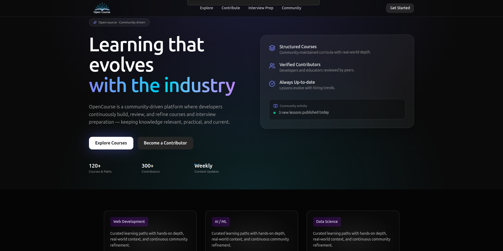
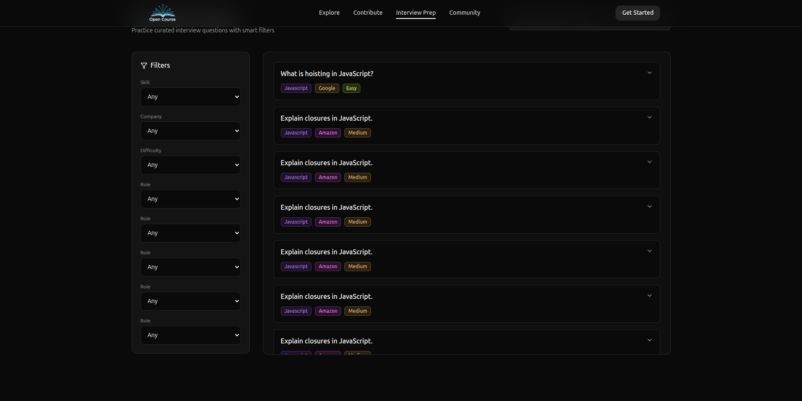
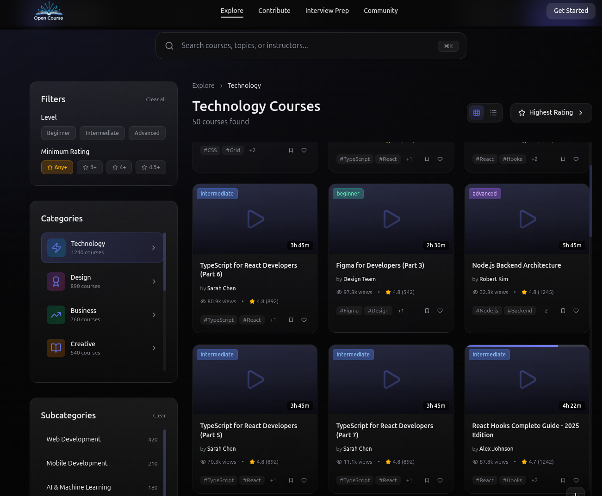
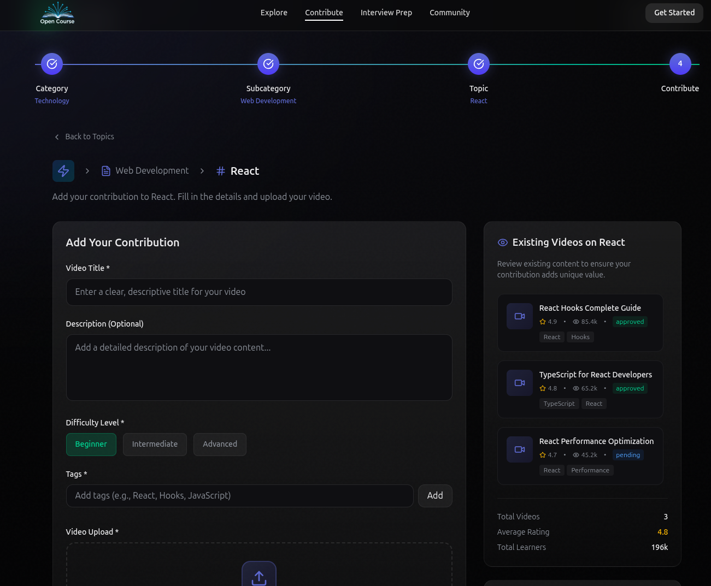

  

<h1 align="center" style="border-bottom: none;">
  Open Course
</h1>

  <b>An open, collaborative, and evolving learning platform</b> 
  Knowledge as a living system — built by everyone.

  
  
  
  

 

  <i>Think of Open Course as <b>open-source education</b>.</i>

---

## What is Open Course?

**Open Course** is a modern, community-driven learning platform where courses are not static products but **continuously evolving knowledge systems**.

Unlike traditional platforms where a single creator controls content, Open Course allows **anyone to create, expand, refine, and improve courses together** — similar to how open-source software is built.

Learning here never stops growing.

---

## 🧠 Core Philosophy

- Knowledge should be **open**
- Learning should be **iterative**
- Education should be **collaborative**
- Courses should **evolve with time**

> Open Course treats education like code: fork it, improve it, and share it back.

---

## ✨ Key Features

- **Crowdsourced Courses**  
  Create new courses or contribute to existing ones.

- **Continuous Improvement**  
  Courses evolve instead of becoming outdated.

- **Multi-Contributor Learning**  
  Lessons can be improved by multiple contributors.

- **Focused Learning Experience**  
  Clean UI designed for deep focus.

- **Dark-First Modern UI**  
  Optimized for long learning sessions.

- **Community-Owned Knowledge**  
  Powered by people, not institutions.

---

## 🖥️ Tech Stack

### Frontend
- **React**
- **Tailwind CSS**
- Component-based architecture
- Fully responsive design

### Backend *(planned / in progress)*
- Node.js API
- Authentication & authorization
- Contribution review & moderation

### Database *(planned)*
- Relational / document-based (TBD)

---

## 📸 UI Preview

  

  <i>Designed to communicate openness, clarity, and collaboration.</i>

---
